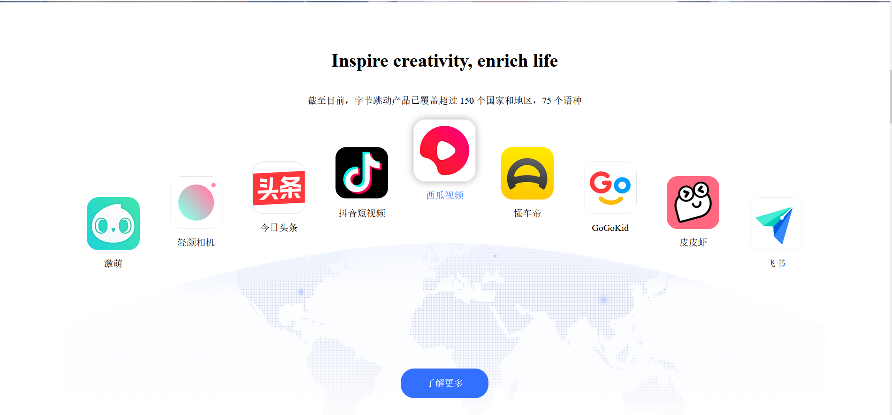
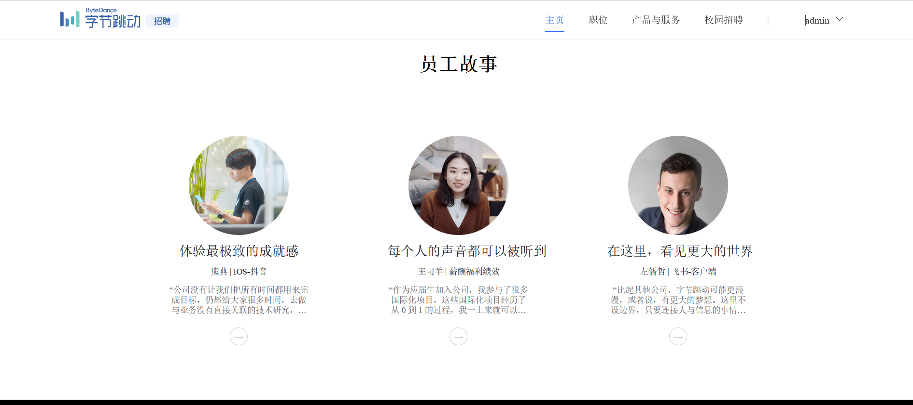
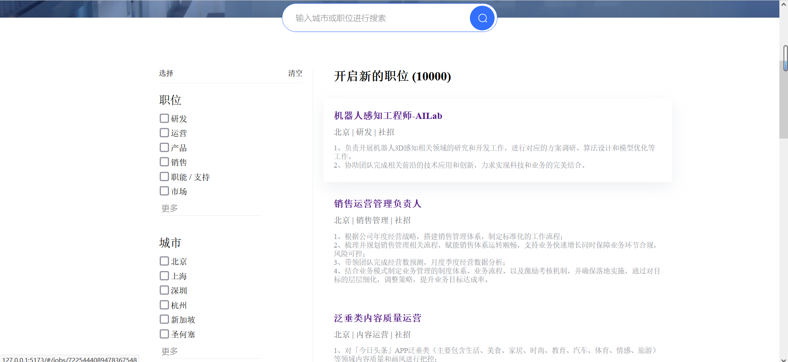
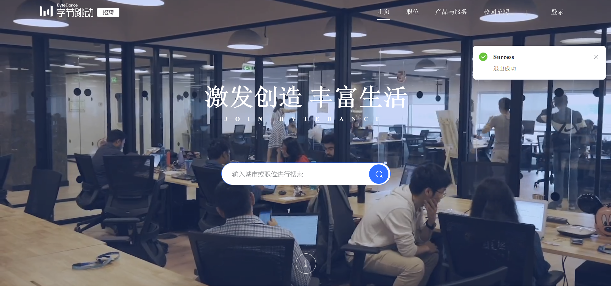
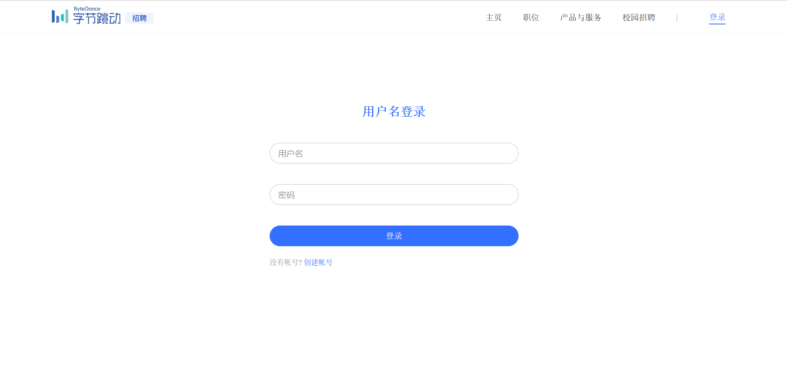
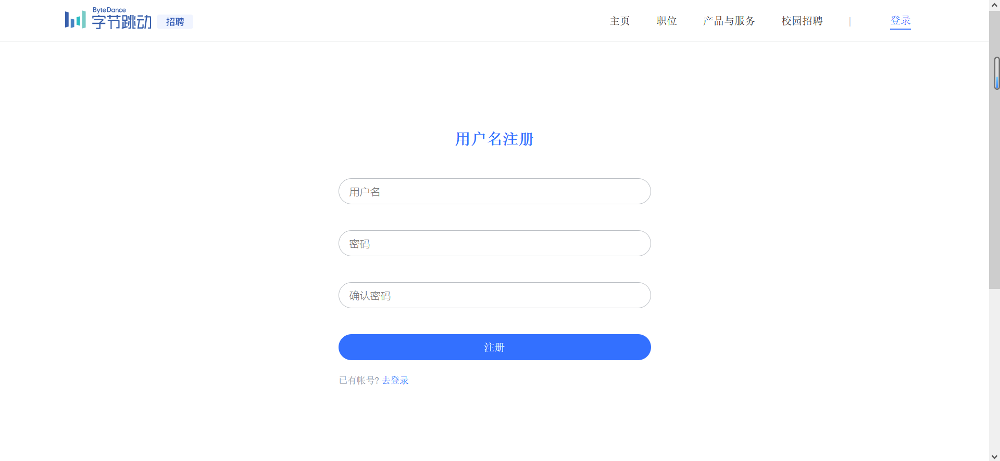

# Vue 3 + Vite

This template should help get you started developing with Vue 3 in Vite. The template uses Vue 3 `<script setup>` SFCs, check out the [script setup docs](https://v3.vuejs.org/api/sfc-script-setup.html#sfc-script-setup) to learn more.

## Recommended IDE Setup

- [VS Code](https://code.visualstudio.com/) + [Volar](https://marketplace.visualstudio.com/items?itemName=Vue.volar) (and disable Vetur) + [TypeScript Vue Plugin (Volar)](https://marketplace.visualstudio.com/items?itemName=Vue.vscode-typescript-vue-plugin).

## ⚡系统描述

本系统为字节招聘网站的**Vue3**版本， 技术栈使用Vue3、Element Plus、VueX、Axios 和 Vite 等主流技术.

- Vue-Cli 5.x 版: [v3-admin](https://github.com/un-pany/v3-admin)
- Electron 桌面版: [v3-electron-vite](https://github.com/un-pany/v3-electron-vite)

## 技术栈特性
- **Vue3**：采用 Vue3 + script setup 最新的 Vue3 组合式 API
- **Element Plus**：Element UI 的 Vue3 版本
- **VueX**: 传统Vue项目的状态管理工具
- **Vite**：真的很快
- **Vue Router**：路由路由
- **TypeScript**：JavaScript 语言的超集
- **PNPM**：更快速的，节省磁盘空间的包管理工具
- **Less**：更方便的变量使用和CSS嵌套语法
- **CSS 变量**：主要控制项目的布局和颜色
- **ESlint**：代码校验
- **Prettier**：代码格式化
- **Axios**：发送网络请求（已封装好---包括开发,生产和测试三种环境的封装）
- **UnoCSS**：具有高性能且极具灵活性的即时原子化 CSS 引擎
- **注释**：各个配置项都写有尽可能详细的注释

## 存在问题
这里多说一下，因为字节招聘官网更多是使用自己设计的样式，所以整体UI框架并没有使用Element更多是自己
去编写（从字节官网拿 - -），这里使用ElementPlus的原因是使用了他的消息提示组件和加载组件。

不过像这些组件在项目目录中的**components**文件夹中也有自己编写的自定义插件，但是并没有成功，
所以希望大佬们帮忙看一下，感激不尽！


## 🚀 功能描述
- **用户管理**：登录、登出演示
- **权限管理**：内置页面权限（动态路由）、指令权限、权限函数、路由守卫
- **多环境**：开发环境（development）、测试环境（test）、正式环境（production）
- **产品展示**：展示宣传字节跳动的产品内容，包括抖音，飞书，今日头条，皮皮虾等
- **工作信息**: 工作信息是字节招聘的重点内容，可根据工作地点和工作内容进行分类
- **员工故事**：展示字节员工的生活经历和工作经历
- **个人简历**：用户可以上传个人简历和信息，用于投递工作
- **面试记录**：记录用户面试过的岗位


## 运行

```bash
# 配置
1. 一键安装 .vscode 目录中推荐的插件
2. node 版本 16+
3. pnpm 版本 8.x
# 克隆项目
git clone https://github.com/shdjndbfjjd/byteDance-Vue3.git
# 进入项目目录
cd byte
# 安装依赖
pnpm i
# 启动服务
pnpm run dev
```

## Git 提交规范参考

- `feat` 增加新的业务功能
- `fix` 修复业务问题/BUG
- `perf` 优化性能
- `style` 更改代码风格, 不影响运行结果
- `refactor` 重构代码
- `revert` 撤销更改
- `test` 测试相关, 不涉及业务代码的更改
- `docs` 文档和注释相关
- `chore` 更新依赖/修改脚手架配置等琐事
- `workflow` 工作流改进
- `ci` 持续集成相关
- `types` 类型定义文件更改
- `wip` 开发中


## 项目预览

















## 注意事项

因为现在还只是写了前端，后端暂时只写了登录和注册，所以目前系统中的数据都是假数据，像根据地点
和分类动态展示岗位信息还不能实现。

我现在的想法是后端搞两个版本，一是用Django和DRF来写，第二个版本则是使用Golang，毕竟字节
后端用Go的话会更好一点？ - 。-

如果大家觉得对你们有用的话麻烦给个star吧，star数量多的话我后续会把两个版本后端代码以及整体
项目再次开源出来的。


## 💕 感谢 Star

小项目获取 star 不易，如果你喜欢这个项目的话，欢迎支持一个 star！这是作者持续维护的唯一动力（小声：毕竟是免费的）